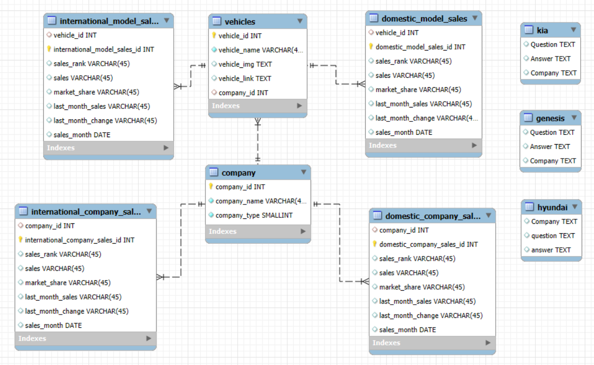
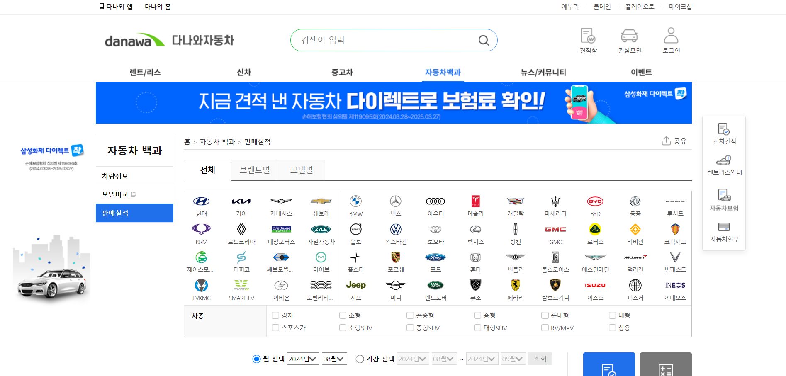
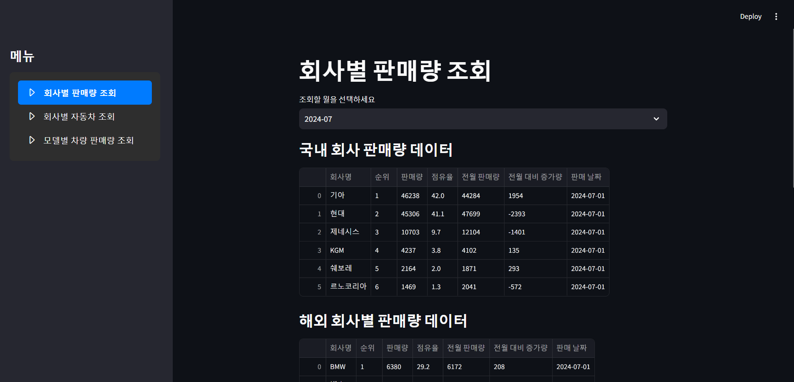
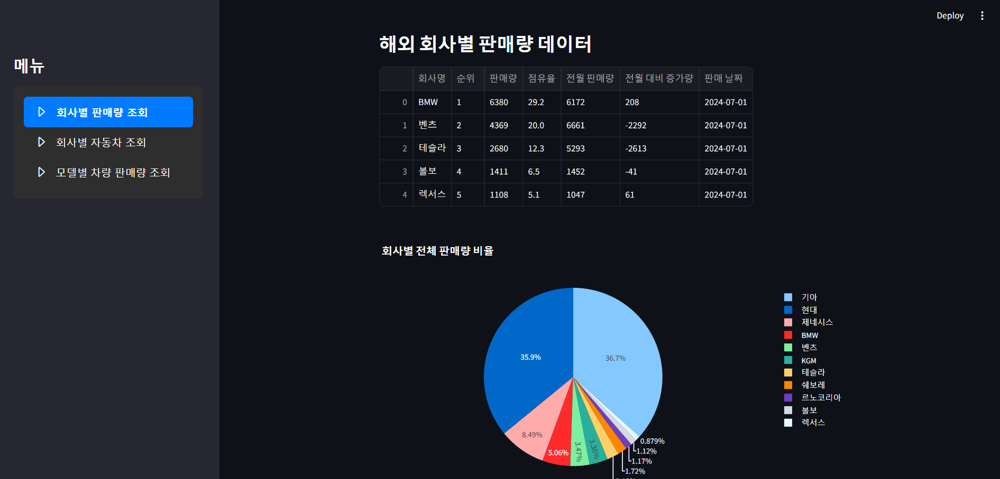
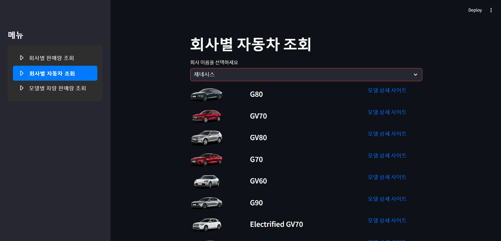
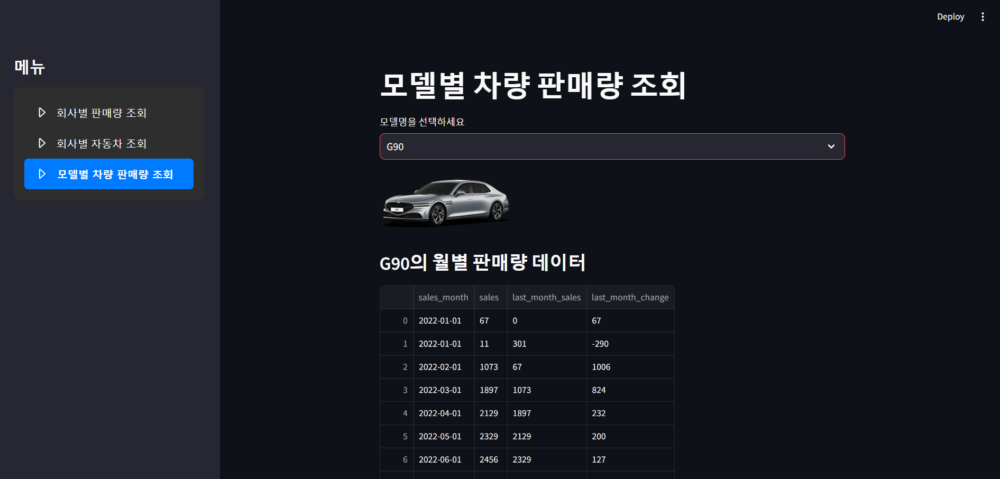
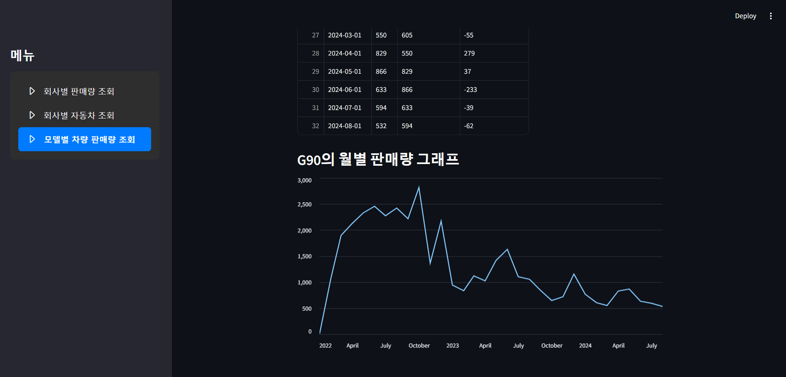

# SKN05-1nd-2Team

 ✅1차 프로젝트
 SK Networks AI CAMP 5기 
 개발기간: 2024.09.05-09.06
 
  ## 💻팀 소개
**팀원**

|  **이준호👨‍💻** |  **안태영👨‍💻** |  **김혜서👩‍💻** |  **박초연👩‍💻** |
|:---------:|:---------:|:---------:|:-----------:|
| @Lanvizu | @Anthony-0502 | @Hyeseo20 |  @Parkchoyeon |
| 총괄| FAQ | 크롤링| 크롤링|

 
## 📑프로젝트 개요
#### 프로젝트 명 
국내외 자동차 판매량 및 기업 FAQ
#### 프로젝트 소개 
국내외 기업별 자동차 판매량 데이터를 수집하여 자동차 현황을 파악하고 이를 기반으로 상위 기업의 FAQ 조회 시스템을 구현
#### 프로젝트 필요성(배경)

#### 프로젝트 목표
- 자동차 모델 및 판매 정보 제공: 고객이 국내외 다양한 자동차 모델의 스펙, 판매 현황, 가격, 성능 등을 쉽게 비교하고 접근할 수 있도록 도와줍니다.
- FAQ 시스템을 통한 답변 제공: 상위 기업 FAQ 조회 시스템을 통해서 궁금증을 빠르게 해결 할 수 있습니다. 
- 판매 현황 데이터 분석: 판매 현황 데이터 분석을 국내외 기업별, 차종별로 데이터를 분석을 하여 고객의 선호도를 한눈에 알아볼 수 있습니다. 
## 📑기술 스택
 </a>
 </a>
 </a>
 </a>

## ERD
 
## 주요 프로시저
- **데이터 수집**

## 수행결과(테스트/시연 페이지)
|  |  |
|:-----------------------------------:|:-------------------------------------:|
| 회사별 판매량 조회 1 | 회사별 판매량 조회 2 |

|  |  |  |
|:-----------------------------------:|:-------------------------------------:|:--------------------------------------:|
| 회사별 자동차 조회 | 모델별 차량 판매량 조회 | 모델별 차량 판매량 조회2 |
 
## 한 줄 회고
